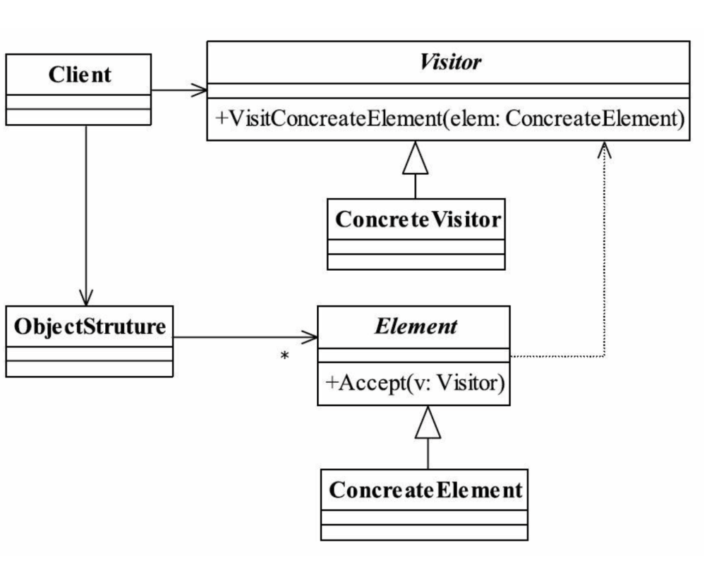

# ASM技术

## ASM是什么

ASM 库的目的是**生成**、**转换**和**分析**以字节数组表示的已编译 Java 类。 ASM 是一个 Java 字节码操控框架。它能被用来动态生成类或者增强既有类的功能。ASM 可以直接产生二进制 class 文件，也可以在类被加载入 Java 虚拟机之前动态改变类行为。 Java class 被存储在严格格式定义的 .class 文件里，这些类文件拥有足够的元数据来解析类中的所有元素：类名称、方法、属性以及 Java 字节码(指令)。 ASM 从类文件中读入信息后，能够改变类行为，分析类信息，甚至能够根据用户要求生成新类。

> ASM 的名字没有任何含义:它只是引用 C 语言中的\_\_asm\_\_关键字，这个关键字允许执行一些用汇编语言编写的函数。

## ASM和javassist

javassist的主要优点是简单，使用javassist不需要了解class文件结构，也不需要了解字节码指令，就能动态改变类的结构或生成类，但这同时也是缺点，这种简单带来了局限性，也导致性能降低。 而ASM恰好与之相反，使用ASM需要了解底层，对使用者有一定的门槛，但ASM没有局限，我们完全可以使用ASM编写任意一个能用Java代码编写的类。

### 文档

> [https://tool.oschina.net/apidocs/apidoc?api=asm](https://tool.oschina.net/apidocs/apidoc?api=asm)

```xml
        <dependency>
            <groupId>org.ow2.asm</groupId>
            <artifactId>asm</artifactId>
            <version>9.3</version>
        </dependency>
```

## ASM原理

### 访问者模式

* 封装一些作用于某种数据结构中的各元素操作，他可以在不改变数据结构的前提下，定义作用于这些元素的操作。
* 下面就是访问者模式的类图，客户端取出存储在对象存储ObjectStruture里面的元素，然后通过访问者去访问，访问者中定义了不同被访问对象的访问模式。



### ASM

ASM 内部采用 访问者模式 将 .class 类文件的内容从头到尾扫描一遍，每次扫描到类文件相应的内容时，都会调用ClassVisitor内部相应的方法。

**例如：** 扫描到**类文件**时，会回调ClassVisitor的visit()方法； 扫描到**类注解**时，会回调ClassVisitor的visitAnnotation()方法； 扫描到**类成员**时，会回调ClassVisitor的visitField()方法； 扫描到**类方法**时，会回调ClassVisitor的visitMethod()方法；

扫描到相应结构内容时，会回调相应方法，该方法会返回一个对应的字节码操作对象(比如，visitMethod()返回MethodVisitor实例)，通过修改这个对象，就可以修改class文件相应结构部分内容。 最后将这个ClassVisitor字节码内容覆盖原来.class文件就实现了类文件的代码切入。

## 更改一个Class

### ClassWriter

ClassWriter继承ClassVisitor，是以字节码格式生成类的类访问者。使用这个访问者可生成一个符合class文件格式的字节数组。 我们可以使用ClassWriter从头开始生成一个Class，也可以与ClassReader一起使用，以修改现有的Class生成新的Class。

```java
构造函数：
ClassWriter classWriter = new ClassWriter(flags);
```

**flags**： **0** 不会自动计算任何东西。必须自行计算帧、局部 变 量与操作数栈的大小。 **ClassWriter.COMPUTE\_MAXS**： 自动计算局部变量表和操作数栈的大小。但仍然需要调用visitMax方法，只是你可以传递任意参数，ASM会忽略这些参数，并重新计算大小。 **ClassWriter.COMPUTE\_FRAMES**： 自动计算方法的栈映射桢。与自动计算局部变量表和操作数栈的大小一样，我们仍然需要调用visitFrame方法，但参数可以随意填。

**COMPUTE\_MAXS** 选项使 ClassWriter 的速度**降低 10%**，而使用 **COMPUTE\_FRAMES** 选项则使其**降低一半**。 这是和我们自行计算时所耗费的时间进行比较的。在某些情况下，存在一些比 ASM 所用算法更容易、更快速的计算方法，但 ASM 使用的算法必须**能够处理所有情况**。

如果选择**自行计算**这些帧，可以让 ClassWriter 为你执行压缩步骤。 需要调用 visitFrame(F\_NEW, nLocals, locals, nStack, stack)访问未压缩帧， 其中的 nLocals 和 nStack 是局部变量的个数和操作数栈的大小，locals 和 stack 是包 含相应类 型的数组(更多细节请参阅 Javadoc)。

（还不太懂）还有，有时需要计算两个给定类的公共超类。默认情况下， ClassWriter 类会在 getCommonSuperClass 方法中进行这一计算，它会将两个类加载到JVM 中，并使用反射 API。 如果我们正在生成几个相互引用的类，那可能会导致问题，因为被 引用 的类可能尚未存在。在这种情况下，可以重写 getCommonSuperClass 方法来解决这一问题。

### Class基础

创建一个ClassWriter对象其实就是创建一个符合class文件结构的空字节数组，但此时这个对象是没有任何意义的，我们需要调用ClassWriter对象的API为该对象填充class文件结构的各项元素。 ClassWriter类的visit方法用于设置类的class文件结构版本号、类的访问标志、类的名称、类的签名、父类的名称、实现的接口。visit方法的定义如下。

```java
public final void visit(final int version,
                        final int access,
                        final String name,
                        final String signature,
                        final String superName,
                        final String[] interfaces)
参数：
version：指定类文件结构的版本号；
access：指定类的访问标志，如public、final等；
name：指定类的名称（内部类名），如“java/lang/String”；
signature：类的类型签名，如“Ljava/lang/String;”；
superName：继承的父类名称。除Object类外，所有的类都必须有父类；
interfaces：该类需要实现的接口。
```

```java
//创建基础信息
String className = "top.rcode.biz.HeShen";
ClassWriter classWriter = new ClassWriter(0);
classWriter.visit(Opcodes.V1_8, Opcodes.ACC_PUBLIC,
        className.replace(".", "/"),
        null,
        //继承类
        Type.getInternalName(Father.class),
        //实现接口
        new String[]{  Type.getInternalName(BaseInterface.class) });
```

### 创建方法

调用ClassWriter的**visitMethod**方法会创建一个**MethodWriter**。MethodWriter的构造方法中会将方法名、方法描述符、方法签名生成CONSTANT\_Utf8\_info常量，并添加到常量池中。 exceptions参数会为异常表的每个异常类型生成一个CONSTANT\_Class\_info常量，并添加到常量池中。 我们在使用完MethodVisitor 之后，与ClassVisitor一样，需要调用实例的**visitEnd**方法。可以说，使用ASM提供的每个访问者，都需要调用一次实例的**visitEnd方法**，一般的使用场景下，不调用visitEnd方法也不会有任何问题。

```java
public final MethodVisitor visitMethod(
    final int access,
    final String name,
    final String descriptor,
    final String signature,
    final String[] exceptions)

access：方法的访问标志，如public、static等；
name：方法的名称（内部类名）；
descriptor：方法的描述符，如“()V”；
signature：方法签名，可以为空；
exceptions：该方法可能抛出的受检异常的类型内部名称，可以为空。
```

#### 方法

* **visitCode**：访问方法的Code属性，实际上也是一个空方法，什么事情也不做；在修改的时候，在这个方法的实现类里面，我们可以在方法的头部添加代码
* **visitMaxs**：用于设置方法的局部变量表与操作数栈的大小；
* **visitInsn**：往Code属性的code数组中添加一条无操作数的字节码指令，如dup指令、aload\_0指令等；
* **visitVarInsn**：往Code属性的code数组中添加一条需要一个操作数的字节码指令，如aload指令；
* **visitFieldInsn**：往Code属性的code数组中添加一条访问字段的字节码指令，用于添加putfield、getfield、putstatic、getstatic指令；
* **visitTypeInsn**：往Code属性的code数组中添加一条操作数为常量池中某个CONSTANT\_Class\_info常量的索引的字节码指令，如new指令；
* **visitMethodInsn**：往Code属性的code数组中添加一条调用方法的字节码指令，如invokevirtual指令。

### 重写方法

```java
    static void generateFatherMethod(ClassWriter classWriter){
        MethodVisitor mv = classWriter.visitMethod(Opcodes.ACC_PUBLIC, "fatherSay",
                "()V", null, null);

        // 调用父类的方法
        mv.visitVarInsn(Opcodes.ALOAD, 0);
        mv.visitMethodInsn(Opcodes.INVOKESPECIAL,
                Type.getInternalName(Father.class),
                "fatherSay",
                "()V", false);


        // 插入输出"SubClass sayHello"的字节码指令
        mv.visitFieldInsn(Opcodes.GETSTATIC,
                Type.getInternalName(System.class),
                "out",
                Type.getDescriptor(System.out.getClass()));
        //ldc指令:
        mv.visitLdcInsn("SubClass sayHello");
        mv.visitMethodInsn(Opcodes.INVOKEVIRTUAL,
                Type.getInternalName(System.out.getClass()),
                "println",
                "(Ljava/lang/String;)V", false);


        mv.visitInsn(Opcodes.RETURN);
        // 设置局部变量表和操作数栈的大小
        mv.visitMaxs(2, 1);
    }
```

> \*\*ldc指令: \*\* 将int、float、或者一个类、方法类型或方法句柄的符号引用、还可能是String型常量值从常量池中推送至栈顶。ldc指令可以加载String、方法类型或方法句柄的符号引用，但是如果要加载String、方法类型或方法句柄的符号引用，则会在类连接过程中重写ldc字节码指令为虚拟机内部使用的字节码指令\_fast\_aldc。

### 构造方法

```java
static void generateMethod(ClassWriter classWriter){
   MethodVisitor methodVisitor = classWriter.visitMethod(Opcodes.ACC_PUBLIC, "<init>", "()V", null, null);
   methodVisitor.visitCode();
   // 调用父类构造器
   methodVisitor.visitVarInsn(Opcodes.ALOAD, 0);
   methodVisitor.visitMethodInsn(Opcodes.INVOKESPECIAL,
                                 "java/lang/Object",
                                 "<init>", 
                                 "()V",
                                 false);
   // 添加一条返回指令
   methodVisitor.visitInsn(Opcodes.RETURN);
   // 设置操作数栈和局部变量表大小
   methodVisitor.visitMaxs(1,1);
   methodVisitor.visitEnd();
}
```

### 添加字段

给类添加字段可调用ClassWriter实例的visitField方法，该方法可添加静态字段，也可添加非静态字段。

```java
public final FieldVisitor visitField(
    final int access,
    final String name,
    final String descriptor,
    final String signature,
    final Object value)

access：字段的访问标志，如public、final、static；
name：字段的名称；
descriptor：字段的类型描述符，如”Ljava/lang/String;”;
signature：字段的类型签名；
value：字段的初始值，此参数只用于静态字段，
如接口中声明的字段或类中声明的静态常量字段，
并且类型必须是基本数据类型或String类型。
```

例如下面就是添加一个常量name，初始值为ks

```java
classWriter.visitField(
    Opcodes.ACC_PUBLIC|Opcodes.ACC_STATIC|Opcodes.ACC_FINAL,
                "name", "Ljava/lang/String;", null, "ks");
```

### 删除方法

自定义的MyClassWriter重写了**ClassVisitor**类的**visitMethod**方法. 当方法名称为“methordName”时，返回null，否则调用父类的visitMethod方法，由父类调用构造MyClassWriter时，参数传入的ClassWriter实例的visitMethod方法，创建main方法与创建main方法访问者。 能够移除main方法的原理是，当visitMethod方法返回null时，main方法不会创建，也不会创建main方法的访问者，因此不会创建“main”方法。

```java
public class MyClassWriter extends ClassVisitor {

        private ClassWriter classWriter;

        public MyClassWriter(ClassWriter classWriter) {
            super(Opcodes.ASM6, classWriter);
            this.classWriter = classWriter;
        }

        @Override
        public MethodVisitor visitMethod(int access, String name, String descriptor, String signature, String[] exceptions) {
            if ("methordName".equals(name)) {
                return null;
            }
            return super.visitMethod(access, name, descriptor, signature, exceptions);
        }

        public byte[] toByteArray() {
            return classWriter.toByteArray();
        }

    }
```

### 改写方法

通过重写了visitCode方法，目的是在方法的第一条字节码指令的前面插入输出“hello word!”的字节码指令。

```java
public class MainMethodWriter extends MethodVisitor {

        private MethodVisitor methodVisitor;

        public MainMethodWriter(MethodVisitor methodVisitor) {
            super(Opcodes.ASM6, methodVisitor);
            this.methodVisitor = methodVisitor;
        }

        @Override
        public void visitCode() {
            super.visitCode();
            
            methodVisitor.visitFieldInsn(GETSTATIC,
                    Type.getInternalName(System.class),
                    "out",
                    Type.getDescriptor(System.out.getClass()));
            
            methodVisitor.visitLdcInsn("hello word!");
            
            methodVisitor.visitMethodInsn(INVOKEVIRTUAL,
                    Type.getInternalName(System.out.getClass()),
                    "println",
                    "(Ljava/lang/String;)V", false);
        }

}
```

重写visitInsn方法，在main方法的return指令之前插入字节码指令。

```java
@Override
public void visitInsn(int opcode) {
    if (opcode == RETURN) {
        // 如果操作码等于return指令的操作码
                // 则在return指令之前插入一些字节码指令
    }
    super.visitInsn(opcode);
}
```

## 类的读取

### ClassReader

```java
ClassReader classReader = new ClassReader("top.rcode.biz.Hello");
classReader.accept(classVisitor,0);
```

accept方法各参数解析：

* classVisitor：类访问者，如ClassWriter；
* parsingOptions：解析选项，可以是SKIP\_CODE、SKIP\_DEBUG、SKIP\_FRAMES、EXPAND\_FRAMES中的零个或多个。零个传0，多个使用“或”运算符组合。
